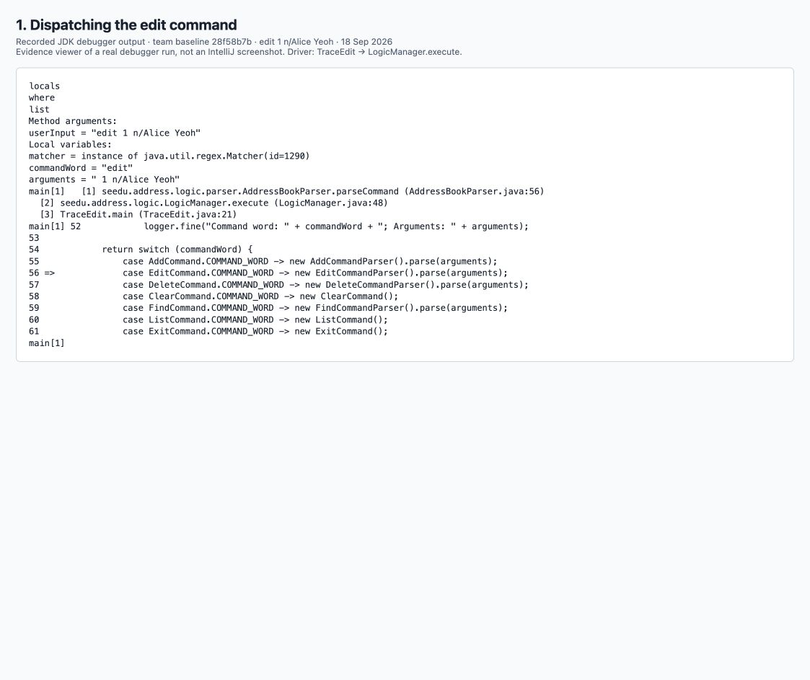
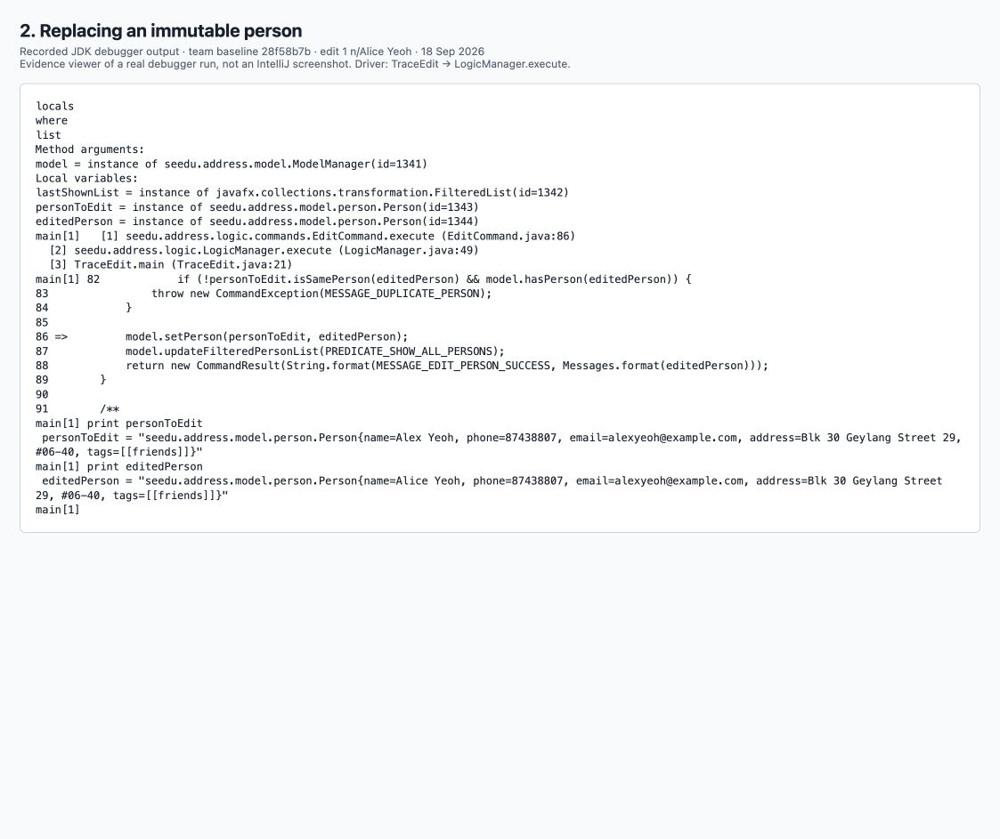
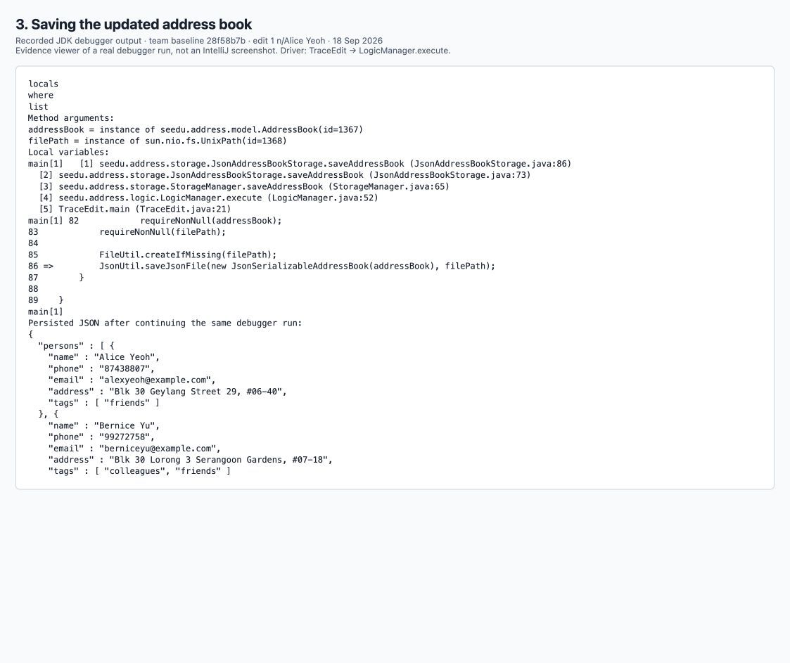

# Tutorial: tracing code

Baseline: team `master` commit `28f58b7b`. Command: `edit 1 n/Alice Yeoh`.

The PNGs show recorded JDK debugger (`jdb`) output from the included `TraceEdit.java` driver.
They are browser captures of transcripts, not IntelliJ screenshots. The matching text files
contain the raw output; the storage capture also shows the saved JSON.
The UI entry and feedback methods were checked in source, not stepped through at runtime.

## What the code does

`CommandBox` passes the input through `MainWindow` to `LogicManager`.
`AddressBookParser` selects `EditCommandParser`, which parses the index and new name.

`EditCommand` replaces Alex Yeoh with Alice Yeoh while preserving the other fields.
The update passes through `ModelManager`, `AddressBook`, and `UniquePersonList`.

`LogicManager` saves the updated data through `StorageManager` and `JsonAddressBookStorage`.
The saved JSON contains Alice Yeoh. In the GUI, `MainWindow` passes the command feedback
to `ResultDisplay`.

## How to repeat the debugger exercise

The course guide is <https://se-education.org/guides/tutorials/ab3TracingCode.html>.
For the intended GUI exercise, open the project in IntelliJ with JDK 25, set a breakpoint in
`MainWindow.executeCommand` at the `logic.execute(commandText)` call, debug `Main`, and enter
`edit 1 n/Alice Yeoh`. Use Step Into to follow the parser, command, model and storage methods,
then return to the result display. Ensure the first entry is the sample `Alex Yeoh` before
repeating, so the before-and-after objects match these captures.

For a CLI reproduction, first check out the baseline in a folder named `tp` and build its
runtime with `./gradlew installDist`. From that checkout, compile and launch the included driver:

```sh
javac -g -cp 'build/install/tp/lib/*' docs/tutorial-tracing/TraceEdit.java
jdb -classpath 'docs/tutorial-tracing:build/install/tp/lib/*' \
    -sourcepath src/main/java TraceEdit /private/tmp/ab3-trace-data
```

The driver uses sample data and writes only to the directory passed as its argument.
Do not rebuild or replace its runtime JAR while the debuggee is paused.

```text
stop at seedu.address.logic.parser.AddressBookParser:56
stop at seedu.address.logic.commands.EditCommand:86
stop at seedu.address.storage.JsonAddressBookStorage:86
run
locals
where
list
cont
locals
where
list
print personToEdit
print editedPerson
cont
locals
where
list
cont
```

Wait for each `print` to finish before continuing. For deeper inspection, use `step`, `next`,
and `step up` instead of `cont`. The breakpoints refer to the stated baseline, not the
adding-command branch, whose added imports may shift line numbers.

## Submission evidence






